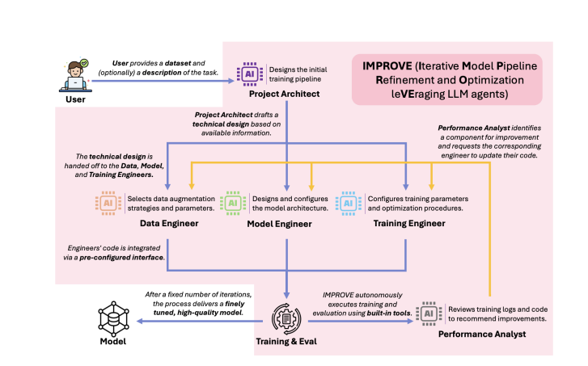

# IMPROVE: ITERATIVE MODEL PIPELINE REFINEMENT AND OPTIMIZATION LEVERAGING LLM AGENTS

## Основная Идея

Статья посвящена проблеме автоматизации процесса разработки высокопроизводительных моделей компьютерного зрения (Computer Vision). Традиционный подход требует глубоких знаний в области машинного обучения (ML) и предметной области, что делает его трудоемким и дорогим.

Хотя агенты на основе больших языковых моделей (LLM Agents) предлагают решение для автоматизации, существующие методы часто пытаются оптимизировать весь конвейер (pipeline) разработки модели за один шаг ("все-сразу"). Этот подход имеет недостатки:
1.  **Низкая интерпретируемость:** Сложно понять, какое именно изменение привело к улучшению/ухудшению.
2.  **Нестабильность:** Результаты могут сильно варьироваться, оптимизация часто происходит случайно.
3.  **Медленная сходимость:** На поздних этапах, когда модель уже достаточно хороша, такой подход с трудом находит дальнейшие улучшения.

Авторы предлагают новую стратегию **Iterative Refinement** (Итеративное Уточнение), вдохновленную рабочим процессом ML-экспертов:
*   Конвейер модели разбивается на логические компоненты (например, аугментация данных, архитектура модели, процедура обучения).
*   На каждой итерации оптимизируется **только один компонент**, основываясь на обратной связи от реального обучения и оценки модели.
*   Остальные компоненты остаются неизменными.
*   Изменения сохраняются только если они приводят к улучшению производительности.

Этот подход обещает улучшить **стабильность**, **интерпретируемость** и **эффективность** процесса оптимизации.

## Реализация: Фреймворк IMPROVE

Для оценки стратегии Iterative Refinement был разработан фреймворк **IMPROVE** (Iterative Model Pipeline Refinement and Optimization leveraging LLM agents).
*   **Автономность:** Принимает на вход только набор данных и самостоятельно генерирует, обучает, оценивает и итеративно улучшает модель классификации изображений.
*   **Многоагентная система:** Эмулирует команду ML-инженеров с разными ролями:
    *   `Project Architect`: Первоначальный анализ и проектирование конвейера.
    *   `Data Engineer`: Работа с данными (аугментация, предобработка).
    *   `Model Engineer`: Выбор и настройка архитектуры модели.
    *   `Training Engineer`: Настройка процесса обучения (гиперпараметры, оптимизаторы).
    *   `Performance Analyst`: Анализ результатов, выявление узких мест и выдача заданий на улучшение одному из инженеров.
*   **Дополнительные возможности:**
    *   Использование информации о наборе данных (предоставленной пользователем или выведенной LLM).
    *   Автономное выполнение сгенерированного кода.
    *   Унифицированная инициализация конвейера (генерация связной базовой версии).

## Основные Результаты

Эксперименты проводились на стандартных бенчмарках (CIFAR-10, TinyImageNet, их C-варианты, VTAB) и реальных датасетах с Kaggle.
*   **Превосходство над Zero-Shot:** IMPROVE **стабильно и значительно** превосходит модели, сгенерированные LLM с помощью простого zero-shot запроса (особенно на сложных и "зашумленных" данных, разница до ~40%).
*   **Стабильность:** Результаты IMPROVE имеют **значительно меньшее стандартное отклонение** по сравнению с zero-shot подходом, что указывает на более надежный и предсказуемый процесс оптимизации.
*   **Сравнимо с экспертами:** На датасетах Kaggle IMPROVE достигает **конкурентоспособной производительности**, сравнимой с результатами топовых участников-людей, при сопоставимом (или даже меньшем) количестве "валидных" итераций оптимизации.
*   **Эффективность Iterative Refinement:** Абляционное исследование показало, что стратегия Iterative Refinement приводит к **более стабильному и последовательному улучшению** производительности по сравнению с подходом "все-сразу", хотя последний может случайно давать лучшие результаты на ранних этапах.
*   **Работа с меньшими LLM:** IMPROVE демонстрирует хорошие результаты даже при использовании менее мощных и более дешевых моделей, таких как GPT-4o-mini.
*   **Dataset-Awareness:** Фреймворк эффективно использует предоставленную информацию о датасете для выбора более релевантных шагов (например, аугментаций).

## Вывод

Стратегия **Iterative Refinement** является эффективным подходом для создания LLM-агентов, автоматизирующих разработку ML-моделей. Фреймворк **IMPROVE** демонстрирует практическую реализацию этой стратегии, позволяя получать высококачественные модели компьютерного зрения без необходимости глубокой ML-экспертизы со стороны пользователя, приближаясь к уровню человеческих специалистов.
